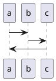

# 一、安装

## 1. ubuntu

### 1.1. 安装nodejs和npm

```shell
curl -sL https://deb.nodesource.com/setup_8.x -o nodesource_setup.sh
sudo bash nodesource_setup.sh
sudo apt-get install nodejs
```

### 1.2. 安装hexo和hexo-cli

```shell
sudo npm install hexo -g
sudo npm install hexo-cli -g
```

### 1.3. 迁移博客代码到另一台电脑

- 先安装`hexo`和`hexo-cli`的环境
- 然后执行

```shell
# 安装所有组件忽略脚本
sudo npm install --ignore-scripts
sudo npm audit fix
```

# 二、配置

## 1. 自定义css样式

- 修改主题的配置文件`themes/next/source/css/main.styl`
- 在下面语句后面加css样式即可，如下面把代码块的tab宽度改成4个空格

```html
// Custom Layer
// --------------------------------------------------
pre {tab-size: 4;}
```

# 三、插件和操作

## 1. 博客置顶

### 单纯置顶

```shell
npm uninstall hexo-generator-index --save
npm install hexo-generator-index-pin-top --save
```

- 然后在需要置顶的文章的Front-matter中加上top属性即可，根据top属性的大小排序，越大越靠前。比如下面这篇文章：

```
    ---
    title: hexo+GitHub博客搭建实战
    date: 2017-09-08 12:00:25
    categories: 博客搭建系列
    top: 5
    ---
```

## 2. pdf插件

### 安装

- 在博客bash中执行下列命令安装

```shell
    npm install --save hexo-pdf
```

### 展示

- 使用外部文章网页链接

```php
    
```

- 本地

需要创建一个同名的文件夹，放我们要上传的PDF文章

```php

```

## 3. 字数统计和阅读时长(网站底部/文章内)

### 安装插件

```shell
npm install hexo-symbols-count-time --save
```

### 修改 站点配置文件

```yml
symbols_count_time:
    #文章内是否显示
    symbols: true
    time: true
    # 网页底部是否显示
    total_symbols: true
    total_time: true
```

### 修改 主题配置文件

```yml
# Post wordcount display settings
# Dependencies: https://github.com/theme-next/hexo-symbols-count-time
symbols_count_time:
    separated_meta: true
    #文章中的显示是否显示文字（本文字数|阅读时长）
    item_text_post: true
    #网页底部的显示是否显示文字（站点总字数|站点阅读时长）
    item_text_total: false
    # Average Word Length (chars count in word)
    awl: 4
    # Words Per Minute
    wpm: 275
```

## 4. latex公式支持

### Next主题中自带latex插件

修改`_config.xml`文件即可

#### <span id = "latex">注意事项</span>

##### 1. 表格中不能使用`\|`，需要使用latex中的`\mid`来代替

示例

```latex
| 描述       | 代码              |
| ---------- | ----------------- |
| 使用`\|`   | a            \| b |
| 使用`\mid` | a $ \mid $ b      |
```

效果

| 描述       | 代码              |
| ---------- | ----------------- |
| 使用`\|`   | a            \| b |
| 使用`\mid` | a $ \mid $ b      |

##### 2. latex公式在hexo中不能写注释，并且换行使用`\\`无效，需要使用`\\\\`，大括号需要使用`\\{`才可使用

##### 3. latex公式在hexo中，出现没有解析成公式的情况，仔细对照代码和显示的代码，找到少的那个特殊字符（如`_`），给它加上`\`

## 5. sitemap生成工具

### 5.1. google

```shell
npm i hexo-generator-sitemap --save
```

### 5.2. baidu

```shell
npm i hexo-generator-baidu-sitemap --save
```

## 6. baidu站点自动提交

```shell
npm install hexo-baidu-url-submit --save
```

修改`_config.yml`

```yml
deploy:
- type: git
  repository: git@github.com:Githubwyb/Githubwyb.github.io.git
  branch: master
- type: baidu_url_submitter

#设置百度主动推送
baidu_url_submit:
  count: 500                   # 比如200，代表提交最新的200个链接
  host: githubwyb.github.io    # 在百度站长平台中注册的域名，这个改为你自己的域名
  token: xxxxxx                # 请注意这是您的秘钥， 所以请不要把博客源代码发布在公众仓库里!
  path: baidu_urls.txt         # 文本文档的地址， 新链接会保存在此文本文档里，这个默认
```

## 7. plantuml支持

```shell
npm install --save hexo-filter-kroki
```

[hexo-filter-kroki文档](https://www.npmjs.com/package/hexo-filter-kroki)

### 7.1. 配置

- 不配置就是默认的配置
- 注意不能替换成plantuml搭建的服务器，因为默认是base64加密，和plantuml不一致

```yml
kroki:
  # the kroki free service server, you may switch to your self-hosted sever.
  server: "https://kroki.io/"       # 服务器地址，想要自己搭建就 docker pull yuzutech/kroki
  # Available values
  # "inline": <svg>xxx<svg/>
  # "inlineUrlEncode": 
  # "inlineBase64": 
  # "localLink": 
  # "externalLink": 
  link: "externalLink"

  # common options: svg/png
  outputFormat: "svg"
  # the generated img will have a default class name.
  className: 'kroki'

  # append some fragment per diagram, used for the theme or else config
  inserts:
    - diagram: plantuml
      after: 1
      # see https://plantuml.com/en/theme
      fragment: '!theme sketchy-outline'
    - diagram: mermaid
      after: 0
      # see https://mermaid-js.github.io/mermaid/#/theming
      fragment: "%%{init: {'theme': 'base', 'themeVariables': { 'primaryColor': '#ff0000'}}}%%"
```

### 7.2. 搭建kroki本地服务器

```shell
docker pull yuzutech/kroki
docker run -d -p 8000:8000 yuzutech/kroki
```

**效果**

在markdown中写入

````markdown
` ``plantuml
@startuml
a->b
b->c
c->a
@enduml
```
````



# 踩坑记

## 1. [latex注意事项](#latex)

## 2. 自建域名在博客部署后解析失败

### 原因

- 博客部署到github上时，如果使用自建域名需要添加`CNAME`文件到根目录下
- hexo在部署时会把远程仓库整个覆盖掉，导致`CNAME`文件缺失而解析失败

### 解决方法

- 在`\hexo\source`目录下放入`CNAME`文件即可
- 所有source目录下的除了规定格式的会解析，其余文件都会原封不动放入仓库
