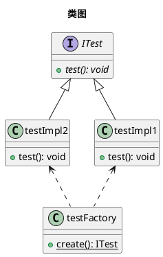

# 一、面向对象基本概念

1. 三大特性：封装-继承-多态
2. 一些相关的重要概念：抽象-组合-动态绑定-消息传递

## 1. 类之间的关系

### 1.1. 组合

- 整体拥有部件，部件生命周期跟随整体
- 部件仅能被一个整体拥有

### 1.2. 聚合

- 整体拥有部件，但是部件生命周期不随整体
- 部件可以被多个整体拥有

# 二、设计模式

由面向对象基本特性得来的设计模式包括三类23种，如下所示：

## 设计原则

1. OCP-开放封闭原则: 开放扩展，封装更改
2. LSP-里氏代换原则: 子类必须能够替换其父类
3. DIP-依赖倒转原则: 抽象不应依赖细节，细节应依赖抽象（面向接口）
4. ISP-接口隔离原则: 一个类对另外一个类的依赖应当建立在最小的接口上
5. CARP-合成/聚合复用原则: 尽量使用合成/聚合，尽量不要使用继承（因继承是强偶合）
6. LoD-迪米特法则: 若两个类不必直接通信，则不应直接交互。成员该私有要私有
7. SRP-单一职责原则: 就一个类而言，应该仅有一个引起它变化的原因
8. 封装变化点，分析需求上的易变点和不变点，将易变的封装成类

## A．创建型模式

### 1. 工厂方法模式（虚拟构造子模式/多态性工厂模式）


定义一个创建实例对象的工厂接口，将实际创建工作推迟到子类中。

**适用场景**

1. 如果一个类的构造函数比较复杂，需要进行各种判断和查询等，建议使用工厂模式，将类的构造变简单可拓展
2. 如果期望类的实现未来变化，将使用新的类进行替换，可以使用工厂模式，后续直接使用v2替换工厂里面的new，一般接口和实现分离的库使用工厂模式
3. 如果一个抽象类有多种实现，各种实现仅对外提供一个抽象接口类，可以使用工厂根据不同的类型返回不同的子类实现
4. 类似下面结构




```go
// 定义接口Product，定义接口存在方法Use
type Product interface {
	Use()
}

// productA继承Product，但外部不可见
type productA struct {
	Product
}

// productB继承Product，但外部不可见
type productB struct {
	Product
}

func (p *productA) Use() {
	fmt.Println("ProductA")
}

func (p *productB) Use() {
	fmt.Println("ProductB")
}

// 对外暴露工厂方法，根据参数创建不同的产品
func ProductFactory(name string) Product {
	switch name {
	case "A":
		return &productA{}
	case "B":
		return &productB{}
	default:
		return nil
	}
}

func main() {
	fmt.Println("Hello world")

	product := ProductFactory("A")
	product.Use()
	product = ProductFactory("B")
	product.Use()
}
```

### 2. 抽象工厂模式


最为抽象最具一般性，向客户端提供一个接口，使客户端在不必指定实例的具体类型的情况下创建多个实例族的实例对象。

```go
// 定义一个抽象工厂
type AbstractFactory interface {
	CreateProduct(name string) Product
	CreateWorker(name string) Worker
}

// 定义产品
type Product interface {
	Use()
}

// 子类产品A
type productA struct {
	Product
}

// 子类产品B
type productB struct {
	Product
}

func (p *productA) Use() {
	fmt.Println("productA")
}

func (p *productB) Use() {
	fmt.Println("productB")
}

// 定义产品工厂，生产产品
type ProductFactory struct{}

func (f *ProductFactory) CreateProduct(name string) Product {
	if name == "A" {
		return &productA{}
	} else if name == "B" {
		return &productB{}
	}
	return nil
}

// 实现抽象工厂接口，但是没有具体实现
func (f *ProductFactory) CreateWorker(name string) Worker {
	return nil
}

// 定义工人
type Worker interface {
	Work()
}

// 子类工人A
type workerA struct {
	Worker
}

// 子类工人B
type workerB struct {
	Worker
}

func (w *workerA) Work() {
	fmt.Println("workerA")
}

func (w *workerB) Work() {
	fmt.Println("workerB")
}

// 定义工人工厂
type WorkerFactory struct{}

func (f *WorkerFactory) CreateWorker(name string) Worker {
	if name == "A" {
		return &workerA{}
	} else if name == "B" {
		return &workerB{}
	}
	return nil
}

// 实现抽象工厂接口，但是没有具体实现
func (f *WorkerFactory) CreateProduct(name string) Product {
	return nil
}

// 使用接口创建具体工厂
func GetFactory(factoryType string) AbstractFactory {
	if factoryType == "product" {
		return &ProductFactory{}
	} else if factoryType == "worker" {
		return &WorkerFactory{}
	}
	return nil
}

func main() {
	// 使用抽象工厂创建产品工厂
	productFactory := GetFactory("product")
	productFactory.CreateProduct("A").Use()
	productFactory.CreateProduct("B").Use()
	// 使用抽象工厂创建工人工厂
	workerFactory := GetFactory("worker")
	workerFactory.CreateWorker("A").Work()
	workerFactory.CreateWorker("B").Work()
}
```

### 3. <span id="instance">单例模式</span>

单例模式一般是用来让整个进程只有一个，一般是管理类。进程只有一个，再多线程情况下就需要考虑线程安全。常见的单例模式一般分为懒汉模式和饿汉模式。

**懒汉模式**

顾名思义，懒，就是用的时候才建立，不用不建立。分为线程安全的实现和非线程安全的实现，线程安全的实现会影响性能。一般由于两种线程安全的实现。

- 单纯加锁
- 双重判断

**饿汉模式**

开场就饿，进程开始就创建。默认就是线程安全的，但是要考虑头文件包含导致的多次创建。并且由于进程起来就创建，可能比较占用性能。

```go
/********** 懒汉模式，非线程安全 **********/
type LasySingleton struct{}

//建立私有变量
var instance *LasySingleton

//获取单例对象的方法，引用传递返回
func GetInstance() *LasySingleton {
	if instance == nil {
		instance = new(LasySingleton)
	}
	return instance
}

/********** 懒汉模式，线程安全 **********/
type SafeSingleton struct{}

var safeInstance *SafeSingleton
var once sync.Once

func GetSafeInstance() *SafeSingleton {
	once.Do(func() {
		safeInstance = new(SafeSingleton)
	})
	return safeInstance
}

/********** 饿汉模式，线程安全 **********/
type HungrySingleton struct{}

var hungrySingleton *HungrySingleton = new(HungrySingleton)

func GetHungrySingleton() *HungrySingleton {
	return hungrySingleton
}

func main() {
	// 懒汉模式，非线程安全
	instance1 := GetInstance()
	instance2 := GetInstance()
	if instance1 == instance2 {
		println("instance1 == instance2")
	}

	// 懒汉模式，线程安全
	instance3 := GetSafeInstance()
	instance4 := GetSafeInstance()
	if instance3 == instance4 {
		println("instance3 == instance4")
	}

	// 饿汉模式，线程安全
	instance5 := GetHungrySingleton()
	instance6 := GetHungrySingleton()
	if instance5 == instance6 {
		println("instance5 == instance6")
	}
}
```

### 4. 建造者模式

- 将复杂对象的构建与其表示分开，使同样的构建过程可以创建不同的表示。

简单来说，存在一个厨师帮你构建一顿饭，包含一个个单独的菜组合。价格和列表不是厨师需要提供的，是饭菜（菜单）提供的。厨师就是建造者，需要的实例时饭菜。需要价格和列表找饭菜要！！！

- 主要用于将一个一个基础的实现，使用建造者进行构建成一个对外接口类
- 建造者只负责处理复杂的构建，需要的能力时从对外接口类获取

```go
// 定义单个饭菜的接口
type item interface {
	GetName() string
	GetPrice() float64
}

// 定义汉堡
type burger struct {
	price float64
	name  string
}

func (b *burger) GetName() string {
	return b.name
}

func (b *burger) GetPrice() float64 {
	return b.price
}

// 定义饮料
type drink struct {
	price float64
	name  string
}

func (d *drink) GetName() string {
	return d.name
}

func (d *drink) GetPrice() float64 {
	return d.price
}

// 定义一顿饭的接口
type Meal struct {
	items []item
}

// 添加饭菜
func (m *Meal) addItem(item item) {
	m.items = append(m.items, item)
}

// 对外暴露获得价格的接口
func (m *Meal) GetCost() float64 {
	var cost float64
	for _, item := range m.items {
		cost += item.GetPrice()
	}
	return cost
}

// 对外暴露获得名称的接口
func (m *Meal) GetItems() []string {
	var items []string
	for _, item := range m.items {
		items = append(items, item.GetName())
	}
	return items
}

// 定义饭菜建造者，提供套餐
type MealBuilder struct{}

// 套餐A，汉堡+饮料
func (b *MealBuilder) CreateMealA() Meal {
	meal := Meal{}
	meal.addItem(&burger{price: 10, name: "burger"})
	meal.addItem(&drink{price: 5, name: "drink"})
	return meal
}

// 套餐B，2个汉堡+2个饮料
func (b *MealBuilder) CreateMealB() Meal {
	meal := Meal{}
	meal.addItem(&burger{price: 10, name: "burger"})
	meal.addItem(&burger{price: 10, name: "burger"})
	meal.addItem(&drink{price: 5, name: "drink"})
	meal.addItem(&drink{price: 5, name: "drink"})
	return meal
}

func main() {
	builder := MealBuilder{}
	// 要一个套餐A，查看价格和列表
	meal := builder.CreateMealA()
	// 价格和列表都是从饭菜获取，建造者不关心，仅进行构建
	fmt.Printf("Meal A: %s, cost: %.2f\n", meal.GetItems(), meal.GetCost())
	// 要一个套餐B，查看价格和列表
	meal = builder.CreateMealB()
	fmt.Printf("Meal B: %s, cost: %.2f\n", meal.GetItems(), meal.GetCost())
}
```

### 5. 原型模式

用原型实例指定创建对象的种类，并且通过拷贝这些原型创建新的对象

```go
// 定义接口，需要实现clone方法
type Painter interface {
	Clone() Painter
	DrawCrcle()
	SetColor(color string)
	GetColor() string
}

type PainterA struct {
	color string
}

func (p *PainterA) Clone() Painter {
	return &PainterA{p.color}
}

func (p *PainterA) DrawCrcle() {
	fmt.Println("PainterA DrawCircle")
}

func (p *PainterA) SetColor(color string) {
	p.color = color
}

func (p *PainterA) GetColor() string {
	return p.color
}

func main() {
	// 原型模式就是需要提供clone的接口，实现对对象的拷贝
	a := PainterA{}
	a.SetColor("red")
	b := a.Clone()
	fmt.Println(b.GetColor()) // red 拷贝后继承属性
	b.SetColor("blue")
	fmt.Println(a.GetColor()) // red 原对象没有改变
}
```

## B．结构型模式

### 6. 适配器模式

- 关键在于兼容，将原有接口兼容当前使用

### 7. 组合（部分-整体）模式

将对象组合成树形结构以表示“部分-整体”的层次结构

### 8. 装饰器模式

动态给对象添加额外职责，比通过生成子类来增加功能更加灵活

- 关键在于加强，原始类的所有接口都进行了实现
- 比如存在一个接口实现了非线程安全的一些方法，使用一个装饰器将所有的方法变成线程安全的调用
- 比如存在一个接口实现了画图，使用一个装饰器将画的图染成红色

```go
// 定义接口画家
type Painter interface {
	DrawCircle()
	DrawRectangle()
}

// 实现一个画家
type PainterA struct {
	Painter
}

type PainterDecorator struct {
	A PainterA // 本身持有一个画家A
	Painter
}

func (p *PainterA) DrawCircle() {
	fmt.Println("PainterA DrawCircle")
}

func (p *PainterA) DrawRectangle() {
	fmt.Println("PainterA DrawRectangle")
}

func (p *PainterDecorator) DrawCircle() {
	fmt.Println("Use red color") // 增加能力
	p.A.DrawCircle()
}

func (p *PainterDecorator) DrawRectangle() {
	fmt.Println("Use red color") // 增加能力
	p.A.DrawRectangle()
}

func main() {
	// 使用原始画家可以进行操作
	painter := &PainterA{}
	painter.DrawCircle()
	painter.DrawRectangle()
	// 使用装饰器加强了画家，做同样的操作
	painter1 := &PainterDecorator{
		A: PainterA{},
	}
	painter1.DrawCircle()
	painter1.DrawRectangle()
}
```

### 9. 代理模式

- 关键在于隔离，不直接访问原始对象
- 和装饰器不同的时，代理模式更多的是封装原始接口，但不改变原始接口的能力
- 比如加上日志打印或者初始化操作，这些并不改变原始接口的能力，并且可以将原始类的实现细节隐藏
- 装饰器并不隐藏原始实现

```go
// 定义接口，但外部不可见
type painter interface {
	init()
	drawCircle()
}

// 定义画家继承接口，同样外部不可见
type painterA struct {
	painter
}

// 定义代理类，封装了painterA
type PainterProxy struct {
	a painterA
}

func (p *painterA) init() {
	fmt.Println("painterA init")
}

func (p *painterA) drawCircle() {
	fmt.Println("painterA DrawCircle")
}

// 代理类处理了初始化，但不修改painterA的实现
func (p *PainterProxy) DrawCircle() {
	if p.a.painter == nil {
		p.a = painterA{}
		p.a.init()
	}
	p.a.drawCircle()
}

func main() {
	// 使用代理类不关心内部painter实现，并且不用关心是否需要初始化
	p := PainterProxy{}
	p.DrawCircle()
}
```

### 10. 享元模式

运用共享技术有效地支持大量的细粒度对象

### 11. 外观（门面）模式

为一组接口提供一个一致的接口，体现了DIP和LoD原则

```go
// 定义一个基础接口，外部不可见
type drawer interface {
	draw()
}

// 继承基础接口定义画圆
type circle struct {
	drawer
}

func (c *circle) draw() {
	fmt.Println("draw circle")
}

// 继承基础接口定义画矩形
type square struct {
	drawer
}

func (s *square) draw() {
	fmt.Println("draw square")
}

// 定义外观模型，将画圆和画矩形封装起来
type Facade struct {
	circleDrawer circle
	squareDrawer square
}

// 实现画圆的接口
func (f *Facade) DrawCircle() {
	if f.circleDrawer.drawer == nil {
		f.circleDrawer = circle{}
	}
	f.circleDrawer.draw()
}

// 实现画矩形的接口
func (f *Facade) DrawSquare() {
	if f.squareDrawer.drawer == nil {
		f.squareDrawer = square{}
	}
	f.squareDrawer.draw()
}

func main() {
	facade := &Facade{}
	facade.DrawCircle()
	facade.DrawSquare()
}
```

### 12. 桥接模式

将抽象部分与其实现部分分离，使它们都可以独立变化，可实现多角度分类

## C．行为型模式

### 13. 策略模式

- 定义一种策略，比如从A到B
- 使用多个方法进行实现此策略，比如飞机、汽车、走路
- 使用者自己选择方法，调用同一个策略进行执行
- 本质是封装公共的调用逻辑和方法，如超市的接口方法为算要付多少钱，但是存在不同的策略，如打几折，满多少送多少等

```go
// 定义策略接口，公共方法为执行策略
type Strategy interface {
	run()
}

// 定义策略A继承策略
type StrategyA struct {
	Strategy
}

// 定义策略B继承策略
type StrategyB struct {
	Strategy
}

// 实现具体的执行策略的方式
func (s *StrategyA) run() {
	fmt.Println("StrategyA")
}

// 实现具体的执行策略的方式
func (s *StrategyB) run() {
	fmt.Println("StrategyB")
}

// 对外仅有一个公共的执行策略的流程，如调用run
func RunStrategy(s Strategy) {
	s.run()
}

func main() {
	// 使用策略A，调用公共执行流程
	strategy.RunStrategy(&strategy.StrategyA{})
	// 使用策略B，调用公共执行流程
	strategy.RunStrategy(&strategy.StrategyB{})
}
```

### 14. 模板方法模式

定义一个操作中算法的骨架，而将一些具体步骤延迟到子类

- 可以认为是一个模板类实现了公共的逻辑，子类只需要实现非公用逻辑即可

```go
// 定义接口
type Product interface {
	Use()
	Print()
}

// 定义模板继承
type ProductTemplate struct {
	Name string
	Product
}

// 定义产品A，继承模板
type ProductA struct {
	ProductTemplate
}

// 定义产品B，继承模板
type ProductB struct {
	ProductTemplate
}

// 模板实现公共接口
func (p *ProductTemplate) Print() {
	fmt.Println("name", p.Name)
}

func (p *ProductA) Use() {
	fmt.Println("ProductA use")
}

func (p *ProductB) Use() {
	fmt.Println("ProductB use")
}

func main() {
	p := ProductA{
		ProductTemplate: ProductTemplate{
			Name: "ProductA",
		},
	}
	p.Use()
	p.Print()
	p1 := ProductB{
		ProductTemplate: ProductTemplate{
			Name: "ProductB",
		}}
	p1.Use()
	p1.Print()
}
```

### 15. 观察者模式(发布-订阅模式)

定义一种一对多的依赖关系，让多个观察者对象同时监听某一个通知者对象


```go
// 定义一个产品，内部存在一个观察者列表
type Product struct {
	Name         string
	observerList []Observer
}

// 定义观察者接口
type Observer interface {
	Update(product *Product)
}

func (p *Product) AddObserver(observer Observer) {
	p.observerList = append(p.observerList, observer)
}

func (p *Product) SetName(name string) {
	p.Name = name
	// 名字变化后，通知所有观察者
	for _, observer := range p.observerList {
		observer.Update(p)
	}
}

// 定义一个观察者A
type ObserverA struct {
	Observer
}

// 实现更新方法
func (o *ObserverA) Update(product *Product) {
	fmt.Printf("ObserverA: %s\n", product.Name)
}

// 定义一个观察者B
type ObserverB struct {
	Observer
}

func (o *ObserverB) Update(product *Product) {
	fmt.Printf("ObserverB: %s\n", product.Name)
}

func main() {
	// 创建一个产品
	product := &Product{}
	// 创建观察者A
	observerA := &ObserverA{}
	// 创建观察者B
	observerB := &ObserverB{}
	// 将观察者A添加到产品中
	product.AddObserver(observerA)
	// 将观察者B添加到产品中
	product.AddObserver(observerB)
	// 修改产品名字
	product.SetName("productA")
	// 修改产品名字
	product.SetName("productB")
}
```

### 16. 迭代器模式

提供顺序访问一个聚合中元素的方法。不常用，因为语言本身已内置

### 17. 职责链模式

使多个对象都有机会获得机会处理请求。这些对象连成一条链。减少请求得与接收者的耦合。如过滤器

### 18. 命令模式

将请求封装成一个对象，以使你可用不同的请求对客户端进行参数化；可对请求进行排除、记录日志、或撤销操作

### 19. 备忘录模式

在不破坏封装的前提下捕获一个对象的内部状态，并在该对象外部保存此状态

### 20. 状态模式

当一个状态改变时，允许改变其行为，看其来像是改变了其类。（将复杂的条件判断转移到多个小类中）

### 21. 访问者模式

表示一个作用于某对象结构中的各元素的操作。把数据处理与数据结构分开

### 22. 解释器模式

对一个语言定义一个文法的表示，并定义一个解释器，来解释语言中的句子，如正则表达式，浏览器。通过解释执行

### 23. 中介者(调停者)模式

用一个中介对象来封装一系列的对象交互。应用于星形结构的对象关系中
